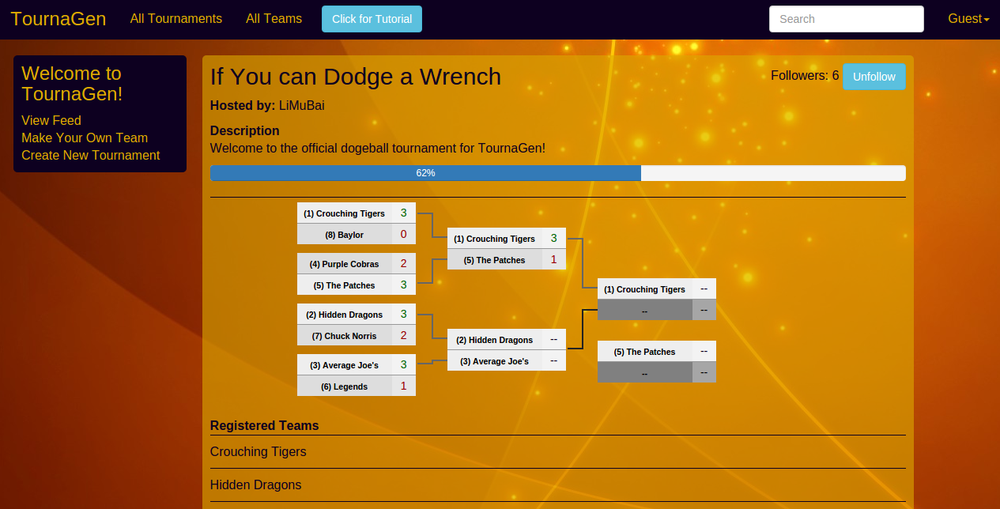
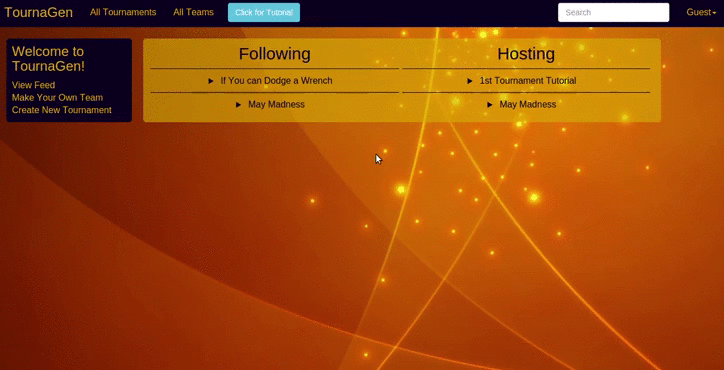

[TournaGen Link][link]

[link]: http://www.tournagen.xyz

# Description

TournaGen is an app loosely based on the website Challonge that allows users to create and update their own
tournaments, follow tournaments, and register for tournaments through a team
they create.

To create a tournament, click on the `Create New Tournament` link
in the sidebar and fill out the necessary details. From there, a bracket should
be automatically created. To update the results of a matchup, click in the score
area and type in the correct results.

## Languages

* Ruby
* Javascript

## Frameworks

* Rails
* Backbone

## Ruby Gems

* bootstrap-sass (main css)
* cloudinary (picture upload)
* figaro (accessory for cloudinary)
* kaminari (infinite scroll)
* seed_dump (quick saving of seeds from development)

## jQuery Plugins

* bracket (generate brackets for tournaments)
* introJs (tutorial for feed page)

## Implementation Details

* Starting Seeds: While the brackets would be automatically generated by the bracket plugin, it would not fill out the starting seeds properly. To do so, I created a method in my Rails Tournament model that create the proper pairings and fill in the seeds with the proper team name. At the moment, tournament seed is based on registration order.

* Saving Bracket: The bracket is saved through a save feature that comes with the bracket plugin. I grab the current results of the bracket and save it as JSON into the database as a results column in the tournaments table.

* Tutorial: A tutorial was created through the introJs plugin. It essentially creates an event that will start the introJs feature, which takes the user step by step through the front page. At the moment, the tutorial can not traverse multiple pages.

* Team Logo: The user can create their own team and upload an image for their team logo. This works because of Cloudinary, a cloud image service widget that lets us save the url of the transformed image as a long string. Figaro is used to create a `config/application.yml` file where we can set `ENV` variables.

* Typeahead Search Bar: The search bar lets users search for teams or tournaments by their name/title. This works by fetching the collections with a data attribute that sets the input as a search param. Rails handles the input in the index part of the controllers and returns the specific models that matches the search param.

* Backbone Log Out: Logging out of a Backbone app requires sending an AJAX request to the Rails controller asking to delete the current session. The app will then redirect the user to the new session page.

* Infinite Scrolling: Infinite Scrolling was implemented with the help of the kaminari gem. Kaminari lets us limit how many models are fetched for a collection in the Rails controller to allow faster initial loading times. When a user scrolls to the bottom of a page, we send another request to the Rails controller asking for the next set of models via page numbers.

## Future Features
- [ ] Group stage implementation for tournaments
- [ ] Custom tournament urls
- [ ] Tournament history
- [ ] Invitations to tournaments
- [ ] Share tournaments
- [ ] Multiple sessions/session management
- [ ] Multipage Tutorial
